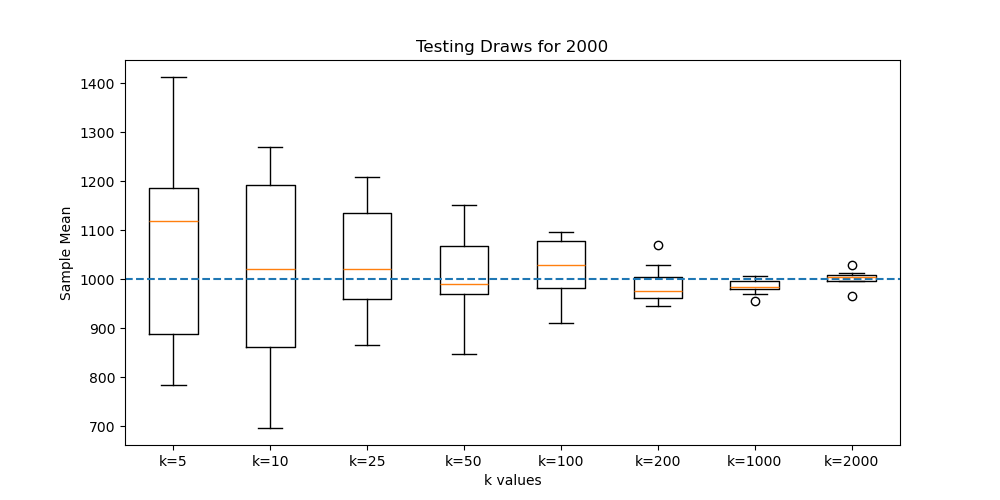

# Law of Large Numbers using Snakemake

## Result 



---

## Brief
This project demonstrates the Law of Large Numbers by randomly sampling numbers from `1 to n` and plotting how the sample mean approaches the expected mean as the number of draws increases

---

## Example Config

```yaml
n: 1000

k_values:
  - 10
  - 50
  - 100
  - 500
  - 1000
  - 2000

repeats: 10
```

---

## Setup

### Requirements

- Python 3.8+
- snakemake

### Install python package

```bash
pip install matplotlib
```

## Run the command

```bash
snakemake --cores 1
```
---

## Output

The pipeline generates a plot like:

```bash
plots/lln_for_n_2000.png
```

---

## Changing Parameters

To test different ranges or add more draw counts, edit the `config.yaml`.

Example:

```yaml
n: 2000
```

or

```yaml
k_values:
  - 10
  - 100
  - 500
  - 2000
  - 5000
```

Then run again:

```bash
snakemake --cores 1
```
---